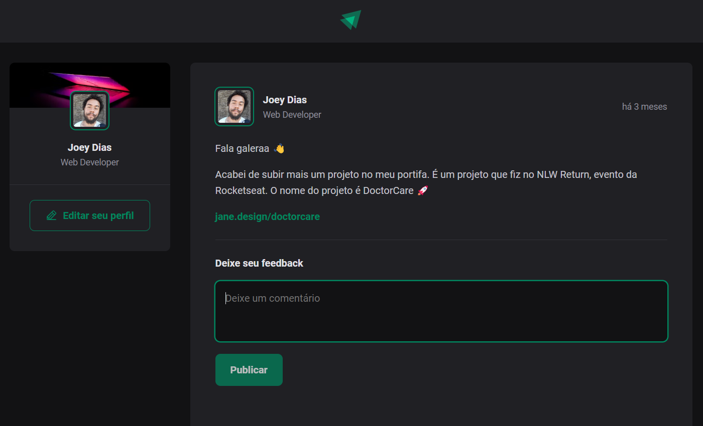

# React + TypeScript + Vite

This template provides a minimal setup to get React working in Vite with HMR and some ESLint rules.

Currently, two official plugins are available:

- [@vitejs/plugin-react](https://github.com/vitejs/vite-plugin-react/blob/main/packages/plugin-react/README.md) uses [Babel](https://babeljs.io/) for Fast Refresh
- [@vitejs/plugin-react-swc](https://github.com/vitejs/vite-plugin-react-swc) uses [SWC](https://swc.rs/) for Fast Refresh

## Expanding the ESLint configuration

If you are developing a production application, we recommend updating the configuration to enable type aware lint rules:

- Configure the top-level `parserOptions` property like this:

```js
   parserOptions: {
    ecmaVersion: 'latest',
    sourceType: 'module',
    project: ['./tsconfig.json', './tsconfig.node.json'],
    tsconfigRootDir: __dirname,
   },
```

- Replace `plugin:@typescript-eslint/recommended` to `plugin:@typescript-eslint/recommended-type-checked` or `plugin:@typescript-eslint/strict-type-checked`
- Optionally add `plugin:@typescript-eslint/stylistic-type-checked`
- Install [eslint-plugin-react](https://github.com/jsx-eslint/eslint-plugin-react) and add `plugin:react/recommended` & `plugin:react/jsx-runtime` to the `extends` list
____________________________________________-

<h1 align="center">
   
</h1>

<div align="center">
   <a href="#desktop_computer-project">
      
   </a>
   <a href="#nail_care-layout">
      
   </a>
   <a href="#technologist-technologies">
      
   </a>
   <a href="#speech_balloon-contact">
      
   </a>
</div>
<br>

## :desktop_computer: Project

Project made through the Ignite course on the [Rocketseat](https://app.rocketseat.com.br/cart/rocketseat-one-black-month-lote-02?referral=joeyanovich&utm_source=platform&utm_medium=organic&utm_campaign=venda&utm_term=mgm&utm_content=indication-lp_one) platform.
In class, it was necessary to build a React project knowing the main fundamentals behind the tool.
<br>
Learn important concepts, such as: components, properties, state, immutability and also about more complex things like react-hook, how React's rendering flow works, how to work with styling within React and about TypeScript applied in the context of the tool.

Concepts that were learned:

- `vite`
- `react-components`
- `react-props`
- `react-hooks`
- `react-state`
- `css modules`
- `typescript`

<br><br>
## :nail_care: Layout

<div align=center>

</div>

<br><br>
## :technologist: Technologies

- [Vite](https://vitejs.dev/)
- [React](https://react.dev/)
- [Typescript](https://www.typescriptlang.org/)

<br><br>
## :clipboard: How to use

Below are the instructions to access the application:

1. Clone the repository: 
```bash 
https://github.com/joeyanovich/ignite-feed.git
```
2. Install all dependencies by using command:
```bash
npm install
```
3. Run the code:
```bash
npm run dev
```

<br><br>
## :speech_balloon: Contact
<br>
<div align="center">
   <a href="mailto:joedison.dias@gmail.com">
      
   </a>
   <a href="https://www.linkedin.com/in/joedisondias/">
      
   </a>
</div>